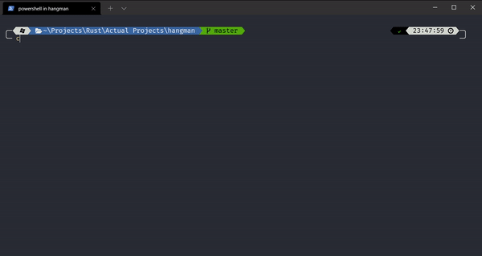

# hangman

A small Rust app that lets you play Hangman in the terminal.

## Running locally

**Make sure you already have `cargo` installed!**

1. Clone the repository.
2. CD into wherever this repository was cloned.
3. Run `cargo r`.

After waiting a bit, you should be able to play Hangman in the terminal.
